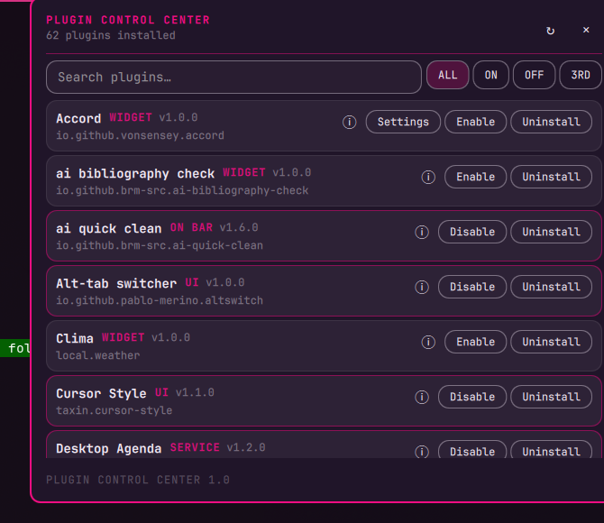

# Plugin Control Center

A compact Omarchy bar widget for seeing and managing the plugins already installed on your system.



## Why it exists

Omarchy makes it easy to install plugins, and community plugins accumulate quickly. After a while, it becomes difficult to answer basic questions:

- What is installed?
- What is enabled or disabled?
- Which plugins are third-party?
- What does a plugin do?
- Which plugin is currently in the bar?
- Which bar widgets expose settings?

Plugin Control Center exists for that inventory problem. It puts the installed plugin registry in one small panel instead of making you inspect `shell.json`, plugin folders, or individual marketplace pages.

## What it does

Open the widget from the bar to:

- list every discovered plugin;
- search by plugin name or ID;
- filter all, enabled, disabled, or third-party plugins;
- read a plugin's declared description and author with the info button;
- see its version, kind, ID, and whether it is in the bar;
- enable or disable plugins;
- edit declared bar-widget settings inline;
- uninstall third-party plugins after confirmation.

The panel reads the live Omarchy `PluginRegistry`. It does not maintain a second catalog or duplicate plugin metadata.

## How it differs from Plugin Control

[Plugin Control](https://github.com/ilyaZar/plugin-control) and Plugin Control Center solve different problems:

- **Plugin Control** is a keyboard-first command palette and lifecycle tool. It searches the marketplace catalog and local cache, adds plugins, enables or disables them, removes them, refreshes catalog sources, and exposes commands such as `plug-add:` and `plug-remove:`. It is optimized for taking an action quickly and can run as a background service.
- **Plugin Control Center** is an installed-plugin inventory and maintenance panel. It shows the complete local registry at once, explains what each plugin does, exposes enabled/bar/third-party state, and edits bar-widget settings where the manifest provides a schema. It does not install plugins, search the marketplace, or maintain a catalog cache.

In short: Plugin Control finds and changes plugins; Plugin Control Center tells you what you already have and helps keep that installation understandable.

## Install

```bash
omarchy plugin add https://github.com/brm-src/plugin-control-center.git --enable
```

Then place the widget in the bar if Omarchy does not add it automatically:

```bash
omarchy plugin enable io.github.brm-src.plugin-control-center
```

Click its bar icon to open the panel. The widget also exposes the standard Omarchy IPC target:

```bash
omarchy-shell io.github.brm-src.plugin-control-center open
omarchy-shell io.github.brm-src.plugin-control-center close
omarchy-shell io.github.brm-src.plugin-control-center toggle
```

## Settings support

A plugin's settings button appears only when its manifest declares a `barWidget.schema`. Values are edited as JSON so strings, numbers, booleans, and structured options remain unambiguous.

Plugins without a declared schema still appear in the inventory and can still be inspected, enabled, disabled, or removed when allowed.

## Safety and scope

- Plugin metadata comes from Omarchy's live registry.
- Uninstall is limited to third-party plugins and requires confirmation.
- Plugin IDs are passed safely to the Omarchy CLI; they are not interpolated into a shell command.
- The plugin adds no packages, services, network calls, or elevated-privilege requirements.
- Like every Omarchy plugin, it runs inside the unsandboxed shell process and should be reviewed before installation.

## Development

The plugin is intentionally only three runtime files: `main.qml`, `Panel.qml`, and `manifest.json`.

Run the local checks from the repository root:

```bash
qmllint -I /usr/share/omarchy/shell *.qml
omarchy plugin validate .
omarchy-shell shell rescanPlugins
```

For a live check, open the widget and inspect the rendered panel:

```bash
omarchy-shell io.github.brm-src.plugin-control-center open
```

For deterministic English screenshots or QA, launch the shell with `PLUGIN_CONTROL_CENTER_LANG=en`. Without that override, the widget follows the system locale.

## License

MIT. See [LICENSE](LICENSE).
