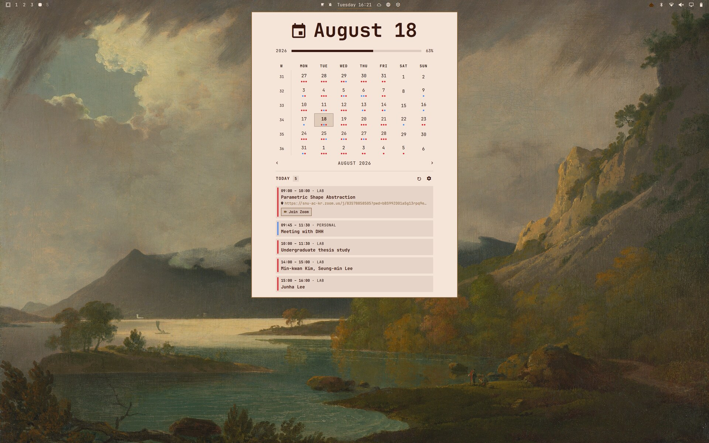
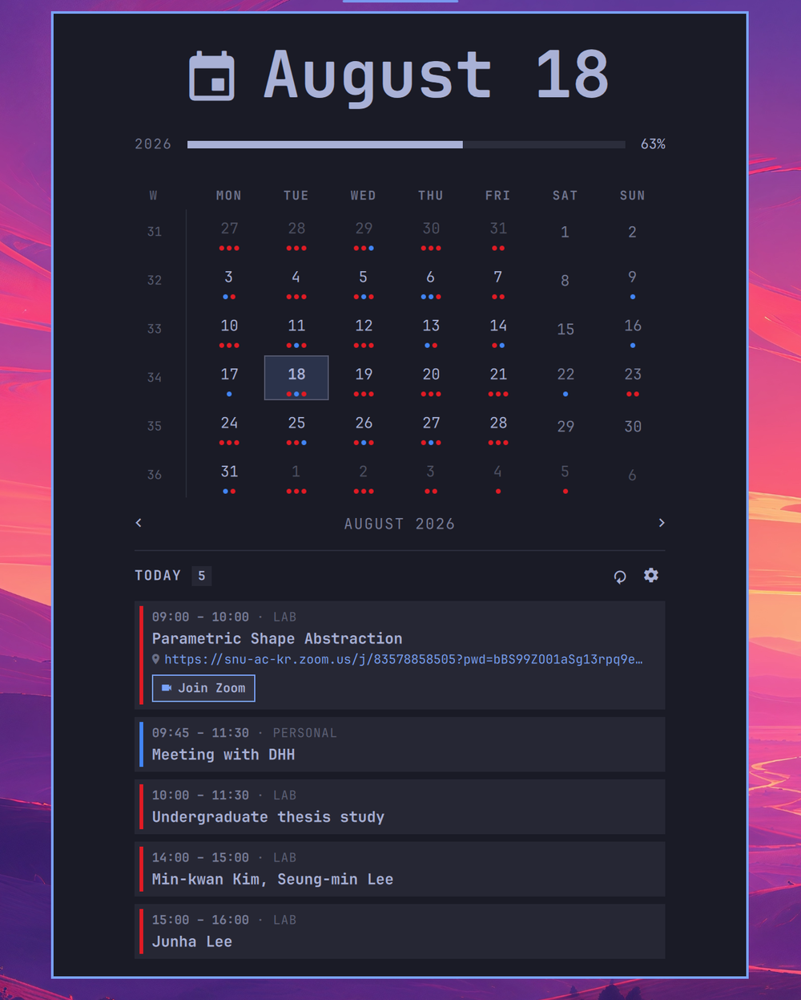
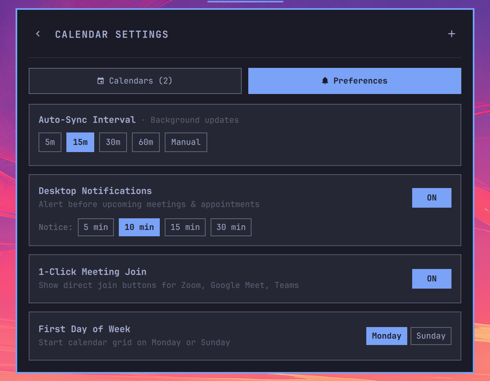

# Calendar Sync for Omarchy and Shibumi

A fast, lightweight calendar and clock status bar plugin for Omarchy's stock bar and Shibumi Shell that syncs Google Calendar, Apple iCloud, Proton Calendar, Microsoft Outlook, Fastmail (JMAP / iCal), Nextcloud, Stalwart, and generic iCalendar (.ics / webcal) feeds directly into your desktop.




## Gallery

| Preview | View |
| --- | --- |
|  | Zoomed calendar view |
|  | Preferences menu |

## Features

- **Two-Way Event Sync & Creation**: Add (`󰐕` or `n` hotkey) and delete (`󰆴`) events directly from your desktop into writable calendars (**Google Calendar API**, **JMAP / Fastmail / Stalwart**, and **Local Offline Calendars**).
- **Universal iCalendar & JMAP Support**: Compatible with any calendar service providing an `.ics` / `webcal://` link (Google, Apple iCloud, Proton, Outlook / Office 365, Nextcloud, generic iCal) or modern **JMAP** API (Fastmail, Stalwart, Cyrus IMAP, Apache James).
- **Offline Local Calendar**: Create and manage local events stored in `~/.local/state/omarchy/local-events.json` without needing any external cloud account.
- **One-Click "Join Meeting"**: Automatically detects Google Meet, Zoom, Microsoft Teams, Webex, and Jitsi links in event details and displays an instant join button.
- **Staged & Configurable Notifications**: Native alerts prior to upcoming meetings with smart staged reminders (10m, 5m, 1m before) or single intervals (5m, 10m, 15m, 30m).
- **Copy Agenda as Markdown**: 1-click clipboard export (`󰆏` button or `y` hotkey) to format your daily schedule into clean Markdown tasks for standups, Slack, or Obsidian.
- **Quick-Toggle Calendar Filter Chips**: Fast single-click filter pills in the agenda header to isolate or show specific calendars on the fly.
- **Configurable Auto-Sync & Instant Refresh**: Customizable background sync intervals (5m, 15m, 30m, 60m, or manual) plus an instant sync button with real-time status.
- **Seamless Theming**: Dynamically inherits the active Omarchy or Shibumi bar colors, fonts, and styling.
- **Multi-Calendar Sync**: Connect multiple calendar accounts and feeds with customizable per-calendar colors and easy enable/disable toggles.
- **Interactive Month Grid**: Click any date to view scheduled events for that day.
- **12/24-Hour Time Preference**: Switch the clock, agenda, notifications, and copied agenda times between 12-hour and 24-hour display.
- **Visual Event Indicators**: Days with events show subtle colored dots corresponding to the calendar source.
- **Fast & Non-Blocking**: Background multi-threaded event fetcher with zero UI freezes.
- **Recurring & Multi-Day Events**: Full support for daily, weekly, monthly, and yearly recurring events (`RRULE` / `EXDATE`) and multi-day spans.

### Keyboard Shortcuts

| Key | Action |
| --- | --- |
| `n` / `N` | **New Event**: Open event creation modal for the selected date |
| `y` / `Y` | **Copy Agenda**: Export day's events to clipboard as Markdown tasks |
| `t` / `T` | **Today**: Jump to current date |
| `[` / `]` | **Month**: Previous / Next month |
| `{` / `}` | **Year**: Previous / Next year |
| `w` / `W` | **Week Start**: Toggle Monday / Sunday week start |
| `Esc` | **Close**: Dismiss Add Event modal, Settings drawer, or Calendar popup |

## Installation

### Stock Omarchy bar

Install with the Omarchy CLI:

```bash
omarchy plugin add https://github.com/promaaa/sync-calendar-omarchy.git --enable --yes
```

This plugin replaces the built-in `omarchy.clock`. After installing, disable
the built-in clock, re-center the bar on the new widget, and pin it as `centerAnchor` in `~/.config/omarchy/shell.json` so the clock does not shift when hovered or resized:

```bash
omarchy plugin disable omarchy.clock
omarchy bar move promaa.clock --section center
sed -i 's/"centerAnchor": "[^"]*"/"centerAnchor": "promaa.clock"/' ~/.config/omarchy/shell.json
```

#### Via GUI

1. Open the Omarchy menu (**Super + Alt + Space**).
2. Go to **Install > Plugins**.
3. Paste the repository URL: `https://github.com/promaaa/sync-calendar-omarchy.git`
4. Hit Enter.

### Shibumi Shell

This plugin implements Shibumi's standard Quattro widget and `KeyboardPanel`
contracts. Its manifest also declares the `clock` semantic capability, so
Shibumi treats it as a clock provider: activating it places it in the center
region and replaces the built-in **Shibumi Center** group instead of showing a
duplicate clock.

1. Open the Shibumi Control Center from the Shibumi wordmark.
2. Open **Plugins** and select **Add plugin**.
3. Paste `https://github.com/promaaa/sync-calendar-omarchy.git`.
4. Acknowledge the third-party plugin warning, install it, and activate
   **Calendar Sync Clock** in the plugin catalog.

The calendar configuration and cached event paths remain under Omarchy's XDG
directories because Shibumi runs inside the existing Omarchy Shell process.

## Configuration

Configure your calendar feeds and preferences using the in-app **Settings Menu (`󰒓`)** or directly in `~/.config/omarchy/calendars.json`:

```json
[
  {
    "name": "Fastmail JMAP",
    "type": "jmap",
    "jmapUrl": "https://api.fastmail.com/jmap/session",
    "jmapToken": "fmu1-xxxxxxxxxxxxxxxx",
    "color": "#ff7700",
    "enabled": true
  },
  {
    "name": "Google Calendar",
    "url": "https://calendar.google.com/calendar/ical/your_email%40gmail.com/private-xxxxxxxxxxxxxxxx/basic.ics",
    "color": "#4285f4",
    "enabled": true
  },
  {
    "name": "Proton Calendar",
    "url": "https://calendar.proton.me/api/calendar/v1/url/xxxxxxxx/calendar.ics",
    "color": "#6d4aff",
    "enabled": true
  },
  {
    "name": "Apple iCloud",
    "url": "webcal://pXX-caldav.icloud.com/published/2/xxxxxxxx",
    "color": "#30d158",
    "enabled": true
  },
  {
    "name": "Outlook / Office 365",
    "url": "https://outlook.live.com/owa/calendar/xxxxxxxx/calendar.ics",
    "color": "#0078d4",
    "enabled": true
  },
  {
    "name": "Nextcloud / CalDAV",
    "url": "https://nextcloud.example.com/remote.php/dav/public-calendars/xxxxxxxx?export",
    "color": "#0082c9",
    "enabled": true
  }
]
```

Edits to `calendars.json` hot-reload automatically without restarting the shell.

## Getting Calendar Links

### Google Calendar (Private iCal)
1. Open [Google Calendar](https://calendar.google.com/) on the web.
2. In the left sidebar, hover over your calendar $\rightarrow$ click the three dots $\rightarrow$ **Settings and sharing**.
3. Scroll down to **Integrate calendar** $\rightarrow$ Copy the **Secret address in iCal format**.

### Apple iCloud Calendar
1. Open [iCloud Calendar](https://www.icloud.com/calendar) or Apple Calendar on macOS / iOS.
2. Click the **Share** icon next to the calendar $\rightarrow$ Turn on **Public Calendar** (or share link).
3. Copy the `webcal://...` link.

### Proton Calendar
1. Open [Proton Calendar](https://calendar.proton.me/) on the web.
2. Go to **Settings** $\rightarrow$ **Calendars** $\rightarrow$ Click **Share** next to the calendar.
3. Under **Share outside Proton**, click **Create link** (choose Full details) and copy the `.ics` link.

### Microsoft Outlook / Office 365
1. Open [Outlook on the web](https://outlook.live.com/calendar/).
2. Go to **Settings (`󰒓`)** $\rightarrow$ **Calendar** $\rightarrow$ **Shared calendars**.
3. Under **Publish a calendar**, select your calendar and permissions $\rightarrow$ Click **Publish** $\rightarrow$ Copy the **ICS** link.

### JMAP Calendar (Fastmail, Stalwart, Cyrus, Apache James)

JMAP is a modern, fast, JSON-based calendar standard ([RFC 9670](https://www.rfc-editor.org/rfc/rfc9670) / [RFC 8984](https://www.rfc-editor.org/rfc/rfc8984)). It syncs directly via API tokens with zero OAuth setup required.

#### 1. Fastmail
1. Go to Fastmail **Settings (`󰒓`)** $\rightarrow$ **Privacy & Security** $\rightarrow$ **Integrations** $\rightarrow$ **Manage API tokens**.
2. Click **New API Token** $\rightarrow$ select **Calendars** (or Full access) $\rightarrow$ Generate and copy the token.
3. Add in the plugin settings (**Settings (`󰒓`) $\rightarrow$ + Add Calendar $\rightarrow$ JMAP**):
   - **Session URL**: `https://api.fastmail.com/jmap/session` *(default)*
   - **API Token**: `fmu1-xxxxxxxxxxxxxxxx`

#### 2. Stalwart / Cyrus / Generic JMAP Servers
- **Session URL**: `https://mail.example.com/.well-known/jmap` (or `https://mail.example.com/jmap/session`)
- **API Token**: Your user / application Bearer token
- **Calendar ID**: *(Optional)* Specific calendar ID or leave blank to query all calendars in your account.

### Nextcloud / ownCloud / Generic iCal
1. In your calendar web interface, open calendar settings / sharing options.
2. Look for **Public link**, **Subscription link**, or **Export / iCal link** (`.ics` or `webcal://`).
3. Paste the URL into the plugin settings.

### Google Calendar API (Restricted Shared Calendars)

> [!TIP]
> **For your own calendars**, use the **Secret address in iCal format** above — it requires zero API setup.
> The Google Calendar API is only needed for shared or organization calendars where iCal export is restricted.

#### 1. Setup Google Cloud Project & Credentials
1. Go to **[Google Cloud Console](https://console.cloud.google.com/)** and create a project (or select an existing one).
2. Enable the **Google Calendar API** under **APIs & Services $\rightarrow$ Library**.
3. Configure the **OAuth consent screen** (<https://console.cloud.google.com/apis/credentials/consent>):
   - Set User Type to **External** (or **Internal** if using a company Google Workspace account).
   - Enter an app name (e.g., `Omarchy Calendar`) and save.
   - Under **Test users**, click **+ Add users** and **add your Google email address**.
4. Create Credentials (<https://console.cloud.google.com/apis/credentials>):
   - Click **+ Create Credentials $\rightarrow$ OAuth client ID**.
   - Set Application type strictly to **Desktop app** *(do not select "Web application")*.
   - Copy your **Client ID** and **Client Secret** (or download the client JSON to `~/Downloads`).

#### 2. Run the Auth Helper
```bash
python3 ~/.config/omarchy/plugins/promaa.clock/google-auth.py
```
- The helper will prompt interactively for your Client ID and Client Secret (or automatically detect the downloaded credentials file in `~/Downloads`).
- A browser window will open asking you to sign in.
- If Google shows *"Google hasn't verified this app"*, click **Advanced $\rightarrow$ Go to Omarchy Calendar (unsafe) $\rightarrow$ Continue / Allow**.

#### 3. Find Your Calendar ID
- For your primary calendar: use `"primary"` or your full email address.
- For secondary or shared calendars: open [Google Calendar](https://calendar.google.com/) $\rightarrow$ Calendar settings $\rightarrow$ Scroll to **Integrate calendar** $\rightarrow$ Copy the exact **Calendar ID** (e.g., `xyz@group.calendar.google.com`).

#### Troubleshooting
* **`Error 400: redirect_uri_mismatch`**: Make sure the credential type is set to **Desktop app**, not Web application.
* **`Access blocked: App has not completed verification`**: Add your Google account email to **Test users** in the OAuth consent screen.
* **`HTTP Error 404: Not Found`**: Check that the `googleCalendarId` is the exact Calendar ID (not the display name). Test the sync with `python3 ~/.config/omarchy/plugins/promaa.clock/fetch-events.py`.


## Uninstallation & Clean Removal

### 1. Remove the Plugin
To remove the plugin from Omarchy:
```bash
omarchy plugin remove promaa.clock --yes
```
To re-enable the default clock widget and restore bar placement:
```bash
omarchy plugin enable omarchy.clock
omarchy bar move omarchy.clock --section center
sed -i 's/"centerAnchor": "promaa.clock"/"centerAnchor": "omarchy.clock"/' ~/.config/omarchy/shell.json
```

### 2. Purge Token-Bearing Configuration and OAuth State
Standard plugin removal unlinks the plugin files, but intentionally retains your configuration and cached state. To completely remove all calendar configurations (including JMAP bearer tokens), OAuth credentials, and cached event data:

**Option A (Automated Purge):**
```bash
python3 ~/.config/omarchy/plugins/promaa.clock/fetch-events.py --purge-data
```

**Option B (Manual Removal):**
```bash
# Token-bearing calendar configuration (contains JMAP bearer tokens and private URLs)
rm -f ~/.config/omarchy/calendars.json

# Google OAuth2 credentials and refresh tokens
rm -f ~/.local/state/omarchy/google-auth.json

# Cached calendar event state and translation cache
rm -f ~/.local/state/omarchy/calendar-events.json
rm -f ~/.local/state/omarchy/translation-cache.json
rmdir ~/.local/state/omarchy 2>/dev/null || true
```


## Contributing

Contributions, bug reports, and suggestions are welcome. Feel free to open an issue or submit a pull request!

## License

This project is licensed under the MIT License. See the [LICENSE](LICENSE) file for details.
